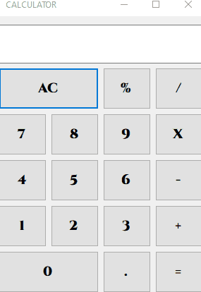

<h1 align="center">
    
    
Mathematics is not about numbers, equations, computations, or algorithms: it is about understanding. ➕➖➗

</h1>

<h1>
    
</h1>

## 🧠 About

The calculator is a project made to train my domain on C# and .Net.

## 🔨 Tools

- [.Net](https://dotnet.microsoft.com/en-us/)
- [C#](https://docs.microsoft.com/pt-br/dotnet/csharp/)
- [Windows Forms](https://docs.microsoft.com/pt-br/dotnet/desktop/winforms/?view=netdesktop-6.0)